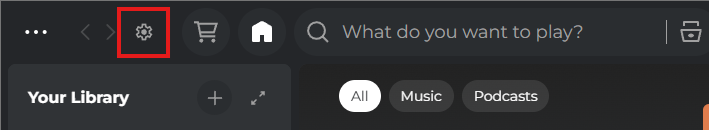

# spicetify-visualizer

Spicetify theme with an audio spectrum visualizer in the player bar, a palette switcher, and a live config panel.

## Preview

Spectrum bars synchronized with music beats, displayed with a fade behind the progress bar. A settings button in the topbar lets you change the theme palette and visualizer appearance in real time.

## Features

- Spectrum visualizer with spring physics (fast attack, slow decay)
- Sync via `Spicetify.getAudioData()` — uses real beats, pitches and timbre from Spotify audio analysis
- Automatic fallback for tracks without analysis: uses real BPM from metadata + stable bar profile per track
- Frequency-mapped bars: bass on the left, treble on the right
- Gradient bars with color matching the active palette
- Top fade via CSS mask to blend with the player
- 5 built-in palettes: **Dracula**, **Orange**, **Nord**, **Catppuccin**, **Rosé Pine**
- Live config panel: palette selector, opacity, height, bar width, bar gap — all persisted

## Config button

The settings button is located in the **topbar**, on the left side next to the back/forward navigation buttons.



Click it to open the config panel:

| Setting | Description |
| --- | --- |
| Theme palette | Switch between Dracula, Orange, Nord, Catppuccin, Rosé Pine |
| Visualizer opacity | How transparent the bars are (0.1 – 1.0) |
| Visualizer height | Height of the canvas behind the player bar (40 – 200px) |
| Bar width | Width of each bar in pixels (1 – 16px) |
| Bar gap | Space between bars in pixels (0 – 8px) |

All settings are saved automatically and restored on next launch. Use **Reset to defaults** to go back to the original values.

---

## Installation

### Requirements

- [Spicetify](https://spicetify.app/docs/getting-started) installed and configured
- Spotify desktop app

### Download

**Option 1 — Git clone:**

```bash
git clone https://github.com/matheduarte/spicetify-visualizer.git
cd spicetify-visualizer
```

**Option 2 — Manual download:**

1. Click **Code → Download ZIP** on the GitHub repository page
2. Extract the ZIP
3. Open the extracted folder

---

### Windows

#### Script (recommended)

```powershell
.\install-windows.ps1
```

Then open Spotify and press `Ctrl+Shift+R`.

#### Manual install

1. Copy the `spicetify-visualizer` folder to `%APPDATA%\spicetify\Themes\`
2. Run:

```powershell
spicetify config current_theme spicetify-visualizer
spicetify config color_scheme Base
spicetify apply
```

---

### Linux / macOS

#### Script — Linux / macOS (recommended)

```bash
chmod +x install-linux-macos.sh
./install-linux-macos.sh
```

Then open Spotify and press `Ctrl+Shift+R`.

#### Manual install — Linux / macOS

1. Copy the `spicetify-visualizer` folder to `~/.config/spicetify/Themes/`
2. Run:

```bash
spicetify config current_theme spicetify-visualizer
spicetify config color_scheme Base
spicetify apply
```
